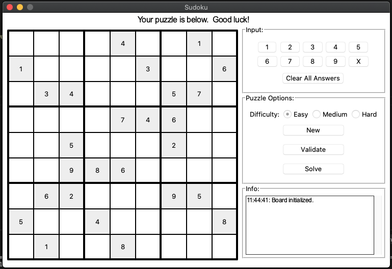

## Overview

The goal of this project was to come up with a simple (and fun) idea that would allow me to work on both my Python and C skills.  The result, as I am pretty sure you are aware, was a way to play Sudoku.  

This allowed me to work on a couple of things completely new to me:
1.  A GUI in Python:  hello [Tkinter](#https://docs.python.org/3/library/tkinter.html)!
2.  Extending Python with C

And work on a couple of things not-so-new to me:
1.  Python programming
2.  C programming
>I should note that apart from some MSP430 & mbed microcontroller programming while working at Texas Instruments, my C programming dates back to my college days.  So, it's novice, but I'm learning.<br><br>That is not to say that I am an expert Python programmer, still have a lot to learn w/ that language as well.<br><br>Pretty much always learning. :)

**Goals**

- Python:
    - GUI
    - GUI control logic
    - board logic testing (pytest)
- C:
    - board logic
        + validation
        + solving
    - Python integration
    - Must haves in code:
        + pointers
        + dynamic memory allocation
        + A bit of recursion (you can solve a board w/ a simple brute-force search)

## Setup

This code was developed using MacOS; therefore, the installation steps are for MacOS.  I hope to test install/setup on other OSes one of these days (time will tell...).

>:exclamation:**IMPORTANT**:exclamation:<br> Python version should be >= 3.7.5.  Sorry if that is an inconvenience.  

I highly recommend pyenv to make handling environment/versions easy.  Check out this cool guide [here](#https://alysivji.github.io/setting-up-pyenv-virtualenvwrapper.html).

#### Step 1: Clone this repository

```console
user$ git clone https://github.com/thejcfactor/sudoku_player.git
```

#### Step 2: Move to the cloned repository directory

```console
user$ cd ./sudoku_player
```

#### Step 3: Create environment (optional, but recommended)

```console
user$ pyenv shell 3.7.5
user$ python -V
Python 3.7.5
user$ pyenv virtualenvwrapper_lazy
user$ mkvirtualenv sudoku_player
WARNING: the pyenv script is deprecated in favour of `python3.7 -m venv`
virtualenvwrapper.user_scripts creating /Users/user/.virtualenvs/sudoku_player/bin/predeactivate
virtualenvwrapper.user_scripts creating /Users/user/.virtualenvs/sudoku_player/bin/postdeactivate
virtualenvwrapper.user_scripts creating /Users/user/.virtualenvs/sudoku_player/bin/preactivate
virtualenvwrapper.user_scripts creating /Users/user/.virtualenvs/sudoku_player/bin/postactivate
virtualenvwrapper.user_scripts creating /Users/user/.virtualenvs/sudoku_player/bin/get_env_details
(sudoku_player) sudoku_player user$
```

#### Step 4: Install Python packages

```console
(sudoku_player) sudoku_player user$ pip install -r requirements.txt
```

#### Step 5: Build the C module

```console
(sudoku_player) sudoku_player user$ python3 setup.py install
```

#### Step 6: Run the program

```console
(sudoku_player) sudoku_player user$ python3 main.py
```

#### Step 7: Play Sudoku



## TODO

- Allow for choice of new board to be easy, medium or hard
- Allow for choosing local board if request to get new puzzle from web board fails
- Validation is in play, so allow for hints?
- Save a board? Users?
- Performance of board solving?
- Time board play?
- Verify installation on other operating systems
    - Linux - I think this should be straight forward, but need to test
    - Windows - I suppose I'll spin up an EC2 instance one day...